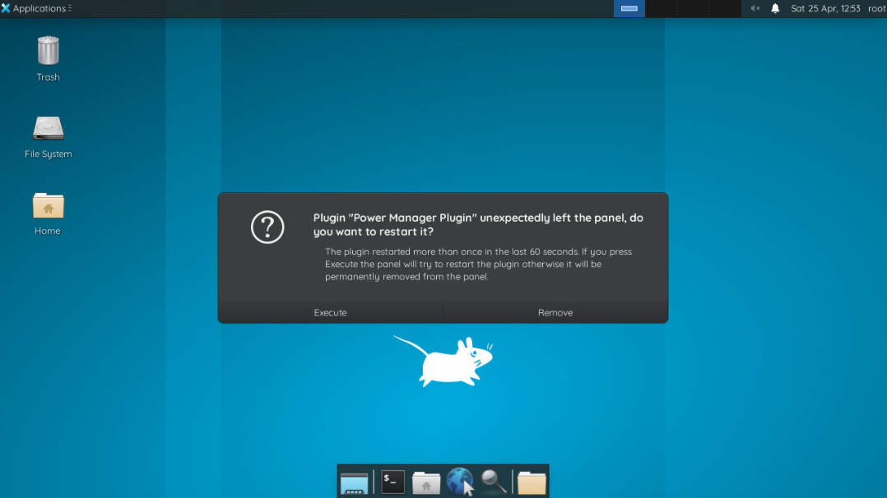

# ColXFCE
## Screenshots


## What is ColXFCE?
ColXFCE installs the XFCE desktop environment on Google Colab's time-limited servers.
## Why would I do that?
Google Colab's standard interface could be more modern, but admit it, it's confusing. You miss the desktop interfaces when it's just terminals and cells.
## How can i download it?
To download this program, you only need one command:
```bash
git clone https://github.com/Scripe3/ColXFCE.git
```
### How can i run it?
To run this program, run this command (in the cell):
```bash
%run ColXFCE/main.py <parameter>
```
parameters:
for-session
for-everyone

## How will I know if it's working?
If it's says:
```bash
for-everyone link: xxxxxxxx
```
or
```bash
for-session link: xxxxxxxx
```
It's running! Enjoy with your XFCE.
